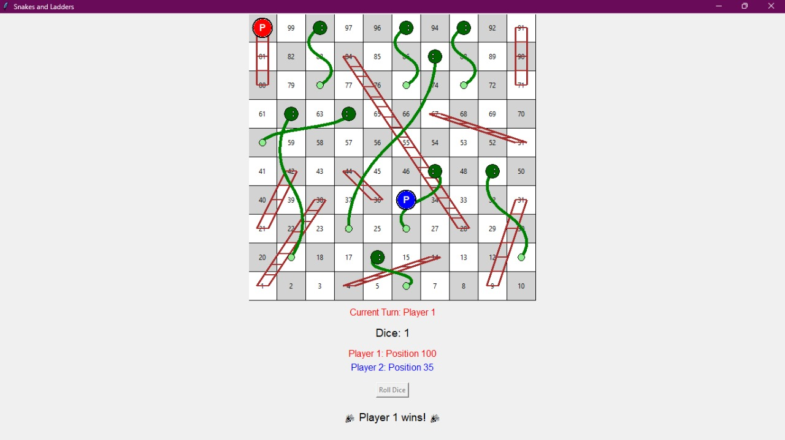

# Snake and Ladder Game

A fun and interactive Snake and Ladder game implemented in Python. This project replicates the classic board game where players navigate from start to finish while encountering ladders that boost progress and snakes that pull them back.

---

## Table of Contents
- [Features](#features)
- [Gameplay Rules](#gameplay-rules)
- [Usage](#usage)
- [Contributing](#contributing)
- [License](#license)

---

## Features
- Single-player or multiplayer mode.
- Randomized dice rolls.
- Automatic handling of ladder boosts and snake penalties.
- Intuitive console-based interface.

---

## Gameplay Rules
- Players start at position 1 and must reach position 100 to win.
- Players roll a dice to determine their move (1 to 6).
- If a player lands at the bottom of a ladder, they climb to the top of the ladder.
- If a player lands on a snake's head, they slide down to the tail.
- Exact dice roll is needed to land on position 100 and win the game.


## Usage

1. Run the game:
   ```bash
   python snake_and_ladder.py
   ```

2. Follow the prompts in the console:
   - Enter the number of players.
   - Take turns rolling the dice by pressing a key or inputting a command.
   - Watch the progress of each player as they navigate the board.

---

## Contributing

Contributions are welcome! Follow these steps to enhance the Snake and Ladder game:

1. Fork the repository.
2. Create a new branch:
   ```bash
   git checkout -b feature-name
   ```
3. Make your changes.
4. Commit your changes:
   ```bash
   git commit -m "Add feature description"
   ```
5. Push your changes:
   ```bash
   git push origin feature-name
   ```
6. Open a pull request describing your changes.

---

## Output

Enjoy playing Snake and Ladder and relive the classic board game experience in Python!

